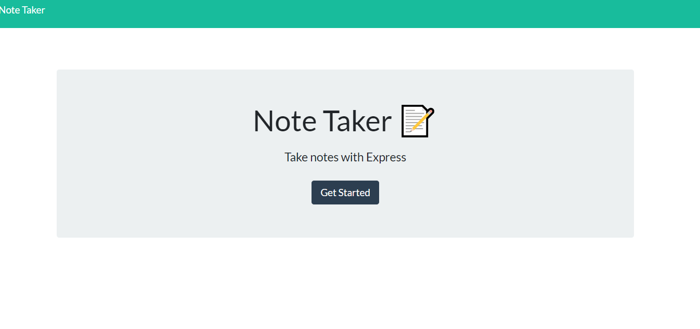
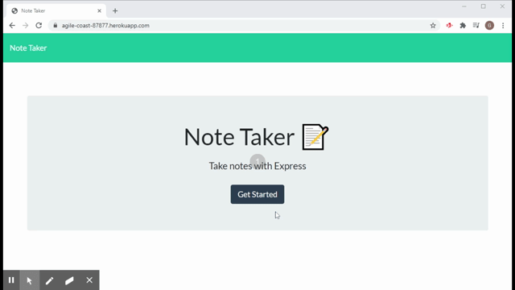

# HW-11-NoteTaker

# Description

The Note taker application allows an individual to create as many notes as needed and save them and also delete them.

# Table of contents

* Description
* Installation
* Usage
* Test 
* Question

# Installation

Installed the node express package

# Usage
You can run the application with the link provided below, and click on get started button, and add 
a title to your new notes and create your notes. Then save the notes and will appear on the the right side of the page.
(https://agile-coast-87877.herokuapp.com/)

# Test 

# Running Application

